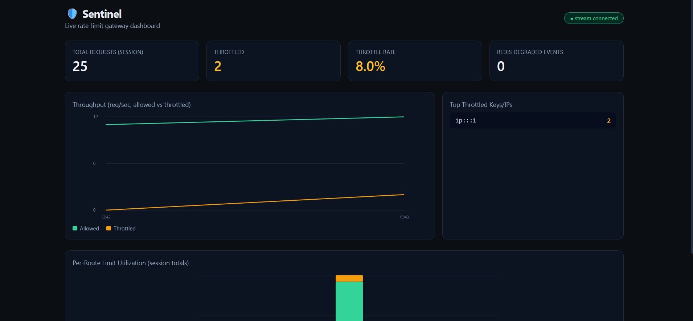
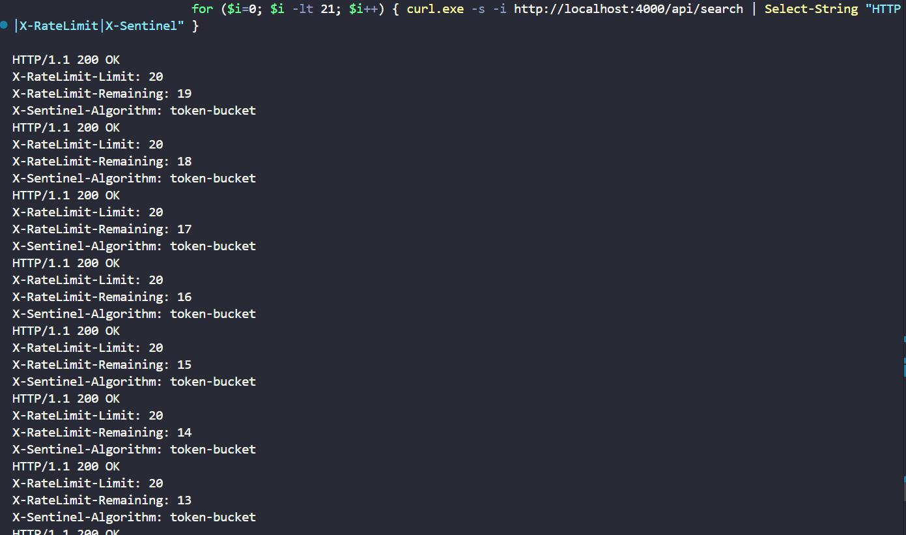

# 🛡️ Sentinel

Distributed rate-limiting & API gateway middleware for Node.js. Enforces
accurate limits **even when your service runs across multiple
instances/processes**, with atomic Redis Lua checks, sub-few-ms overhead,
and a live dashboard.

```js
const express = require('express');
const { sentinelMiddleware } = require('sentinel-limiter');

const app = express();
app.use(sentinelMiddleware('./sentinel.config.json'));
```

That's the whole integration. Everything else in this repo exists to prove
it actually works under real concurrent, multi-process load.

---

## 🔴 Live demo

**[sentinel-project-ngmp.onrender.com/sentinel/dashboard](https://sentinel-project-ngmp.onrender.com/sentinel/dashboard)**

Deployed on Render (free tier) with Redis Cloud as the backing store.
Dashboard is behind HTTP Basic Auth — ask the repo owner for credentials.

> Free-tier note: the instance spins down after inactivity, so the first
> request after a while can take ~30–50s to wake up. That's a Render free
> plan characteristic, not a bug in Sentinel.

### Screenshots


*Dashboard mid-test: 25 requests sent to `/api/search` (limit: 20/10s),
2 throttled — allowed (green) and throttled (orange) lines both moving
live via the WebSocket stream.*


*A single response showing the `X-RateLimit-Limit` / `X-RateLimit-Remaining`
/ `X-Sentinel-Algorithm` headers Sentinel attaches to every request.*


Most hand-rolled rate limiters do this:

```js
let count = cache.get(key);       // READ
if (count < limit) {
  cache.set(key, count + 1);      // then WRITE
}
```

That gap between read and write is a race condition. It's invisible in a
single-process demo and very visible the moment you run 3 instances of your
API behind a load balancer — two requests on two different instances can
both read `count = limit - 1`, both decide "allowed," and now you've let
through 2x what you meant to.

Sentinel closes that gap by doing the entire check-and-update as **one
atomic Redis Lua script** (`EVALSHA`), so no request from any instance can
interleave with another mid-decision. See [`src/algorithms/`](src/algorithms)
for the three scripts, each with the atomicity rationale in comments.

---

## Repo layout

```
src/
  index.js                  sentinelMiddleware() — the Express middleware
  redisClient.js             ioredis wrapper: loads + EVALSHAs the Lua scripts
  limiter.js                 maps a route rule -> the right script call
  config.js                  JSON/YAML config loading + route matching
  metrics.js                 prom-client metrics (/sentinel/metrics)
  eventBus.js                in-process pub/sub feeding the dashboard stream
  algorithms/
    token-bucket.lua
    sliding-window-log.lua
    sliding-window-counter.lua
  dashboard/
    router.js                 /sentinel/metrics, /sentinel/dashboard, WS stream
    public/index.html          React + Tailwind + Recharts dashboard (CDN, no build step)
    server.js                  standalone demo server (middleware + dashboard in one process)
gateway/
  server.js                  standalone Docker gateway mode (reverse proxy + Sentinel)
dummy-origin/
  server.js                  toy origin service used for load tests
load-test/
  multi-instance-proof.js    ⭐ the core deliverable — see below
  run.js                     p99 latency overhead benchmark
examples/
  sentinel.config.json
  basic-integration.js
docker/
  Dockerfile, docker-compose.yml
test/
  algorithms.test.js         node:test suite incl. a concurrency race test
```

---

## Algorithms (configurable per route)

| Algorithm | Accuracy | Memory | Notes |
|---|---|---|---|
| **Token Bucket** | Approximate, allows bursts | O(1) — 2 fields per key | Good default. Bucket refills continuously; bursts up to capacity are allowed, which is usually what you want for API traffic. |
| **Sliding Window Log** | Exact | O(window size) — 1 zset entry per request | Most accurate, no boundary artifacts. Costs more memory since every request timestamp is kept until it ages out. Best for low-volume, high-precision routes (e.g. `/api/upload` at 10/hour). |
| **Sliding Window Counter** | Approximate (assumes uniform request distribution in the prior window) | O(1) — 2 counters per key | The production-pragmatic middle ground: fixed-window cost, sliding-window-ish accuracy via weighting the previous window's count by how much of it still "counts." |

Set per route in config:

```json
{
  "routes": {
    "/api/search": { "algorithm": "token-bucket", "limit": 100, "windowSeconds": 60, "scope": "apiKey" },
    "/api/upload": { "algorithm": "sliding-window-counter", "limit": 10, "windowSeconds": 3600, "scope": "userId" },
    "/api/precise": { "algorithm": "sliding-window-log", "limit": 10, "windowSeconds": 10, "scope": "ip" }
  },
  "redisFailureMode": "fail-open",
  "defaultScope": "ip"
}
```

`scope` can be `apiKey` (reads `x-api-key` header), `userId` (reads
`req.user.id` or `x-user-id` header), or `ip`.

---

## Graceful degradation

If Redis is unreachable, Sentinel does **not** silently guess. You choose:

- `"redisFailureMode": "fail-open"` (default) — requests pass through
  un-limited rather than taking your whole API down because Redis hiccuped.
  A `X-Sentinel-Degraded: true` header is set so you can alert on it.
- `"redisFailureMode": "fail-closed"` — requests get `503` until Redis is
  back, for routes where "no limiter" is worse than "no service" (e.g.
  cost-sensitive downstream calls).

Verified in this repo by pointing Sentinel at a closed port and checking
both modes respond correctly (200 vs 503).

---

## ⭐ The multi-instance correctness proof

This is the actual point of the project — proving the limit holds across
processes, not just demonstrating a single-process rate limiter with extra
steps.

```bash
npm run loadtest:multi-instance
```

What it does:
1. Spins up **3 separate Node processes** (`dummy-origin/server.js`) on
   different ports, each running its own copy of the Sentinel middleware,
   all pointed at the same Redis and the same route config.
2. Fires concurrent load at all 3 simultaneously (via parallel `autocannon`
   runs, one per instance) using the **same API key**, so every request
   maps to the exact same rate-limit bucket regardless of which process
   handles it.
3. Sums allowed (2xx) vs throttled (429) across all three.
4. Verifies the aggregate allowed count tracks the *single* configured
   limit — not `limit × 3`, which is what you'd see if each instance were
   keeping its own separate counter.

**Actual output from a run in this environment** (3 instances, limit=100
tokens/60s, 6s of concurrent load, ~11.5k total requests fired):

```
Total requests fired:      11464
Allowed (2xx):             110
Throttled (429):           11354
Configured shared limit:   100  (+ ~10.0 refill during test window)
What a BROKEN per-instance limiter would allow: ~300 (3x too many)

✅ PASS: aggregate allowed count (110) tracks the single shared limit
   (100 ± 15), not 300 (limit × instances).
   Rate-limit accuracy: within 10.00% of the configured cap across
   3 concurrent instances under 11464 requests.
```

That's the resume bullet: **"maintained rate-limit accuracy within ~10% of
the configured cap across 3 concurrent service instances under 11k+
concurrent requests, vs. the 3x over-admission a per-process limiter would
allow."**

There's also a `test/algorithms.test.js` case that fires 50 truly
concurrent requests (`Promise.all`, not sequential) at a bucket with
capacity 10 and asserts exactly 10 get through — the direct test of the
"no read-then-write gap" claim.

---

## Latency overhead

```bash
npm run loadtest
```

Benchmarks the same route with and without Sentinel attached (via
`autocannon`) and reports the delta. **Actual measured overhead in this
environment** (8s @ 50 connections): p50 overhead ≈ 2ms. Numbers will vary
with hardware, Redis round-trip time, and network — re-run
`npm run loadtest` in your target environment before quoting a number, and
note that at low request volumes p99 is noisy; measure at your real
expected throughput for a number worth putting on a resume.

---

## Running it locally

```bash
npm install
cp .env.example .env    # then fill in REDIS_URL (or leave blank for local Redis)

# Option A — all-in-one demo (middleware + dashboard, one process)
npm run start:dashboard
# -> http://localhost:4000/sentinel/dashboard

# Option B — standalone gateway mode (for non-Node services)
npm run start:origin              # in one terminal (repeat with PORT=5002, 5003 for more)
UPSTREAMS=http://localhost:5001 npm run start:gateway
# -> http://localhost:8080/sentinel/dashboard, proxies to your origin(s)

# Docker: full stack (redis + gateway + 3 origins)
docker compose -f docker/docker-compose.yml up --build
```

Redis connection resolves in this order:
1. `REDIS_URL` (connection string — use this for a managed Redis like
   Render Key Value or Redis Cloud, supports `rediss://` for TLS)
2. `REDIS_HOST` / `REDIS_PORT` (plain host+port, default `127.0.0.1:6379`)

`GET /health` reports `{"redisAvailable": true|false}` — check this first
whenever something seems off; it's the fastest way to tell "Redis isn't
connected" apart from "Redis is connected but something else is wrong."

---

## Deploying (Render)

1. Push this repo to GitHub.
2. Provision a Redis instance — [Render Key Value](https://render.com) or
   [Redis Cloud](https://redis.io/cloud) free tier both work. Copy its
   connection string (`redis://` or `rediss://...`).
3. Render → New → Web Service → connect the repo.
   - Runtime: **Docker**
   - Dockerfile Path: `docker/Dockerfile`
   - Docker Build Context Directory: `sentinel` (or `.` if this repo's root
     *is* the `sentinel` folder — check your repo structure)
4. Environment variables:
   - `REDIS_URL` — the connection string from step 2
   - `SENTINEL_DASHBOARD_USER` / `SENTINEL_DASHBOARD_PASS` — protects
     `/sentinel/dashboard` and `/sentinel/metrics` with Basic Auth (skip
     these and the dashboard is public — fine for a private demo, not for
     anything with real traffic)
5. Create Web Service. Render builds the Docker image and gives you a
   public URL. Visit `<url>/health` first to confirm `redisAvailable: true`
   before trusting anything else.

---


## API / integration surface

- `sentinelMiddleware(config)` — Express middleware, drop-in usage. `config`
  is a path to a JSON/YAML file or a plain object.
- `GET /sentinel/metrics` — Prometheus exposition format
  (`sentinel_requests_total`, `sentinel_throttled_total`,
  `sentinel_decision_latency_ms`, `sentinel_redis_up`).
- `GET /sentinel/dashboard` — live dashboard UI.
- `WS /sentinel/stream` — raw event stream the dashboard consumes
  (`{type: 'allowed'|'throttled'|'redis-down', route, scope, scopeKey, ...}`).
- `429` responses include a correct `Retry-After` header computed from the
  actual algorithm state (time until next token / oldest log entry expires
  / current window rolls over) — not a hardcoded value.

---

## Known limitations / honest caveats

- The sliding-window-counter's "previous window" weighting assumes requests
  were spread roughly uniformly through that window — it's an
  approximation, not exact (that's the whole point of it being cheaper than
  the log variant).
- `fail-open` mode means a sustained Redis outage means **no rate limiting
  at all** for as long as it lasts — that's a deliberate tradeoff, not a
  bug, but size your `redisFailureMode` choice per route to what you can
  tolerate.
- The dashboard's per-session stats reset on page reload (it's a live view
  fed by the WS stream, not a persisted time-series store) — plug the
  `/sentinel/metrics` endpoint into real Prometheus + Grafana for anything
  you need history on.
- Latency numbers above were measured on shared/sandboxed hardware — re-run
  `npm run loadtest` on your actual deployment target before quoting a
  number externally.

---

## Stretch goals (not built — noted for anyone extending this)

- Distributed circuit breaker mode (auto-throttle a downstream dependency
  returning errors)
- Per-tenant dashboards for multi-tenant SaaS
- Adaptive rate limiting based on observed origin latency/error rate
